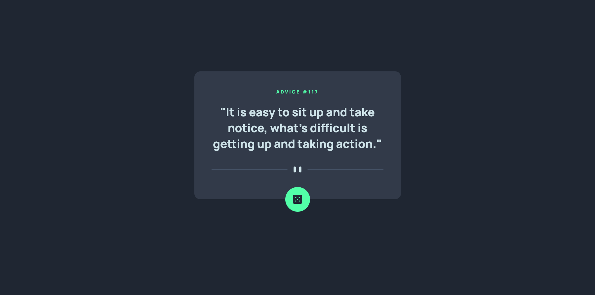
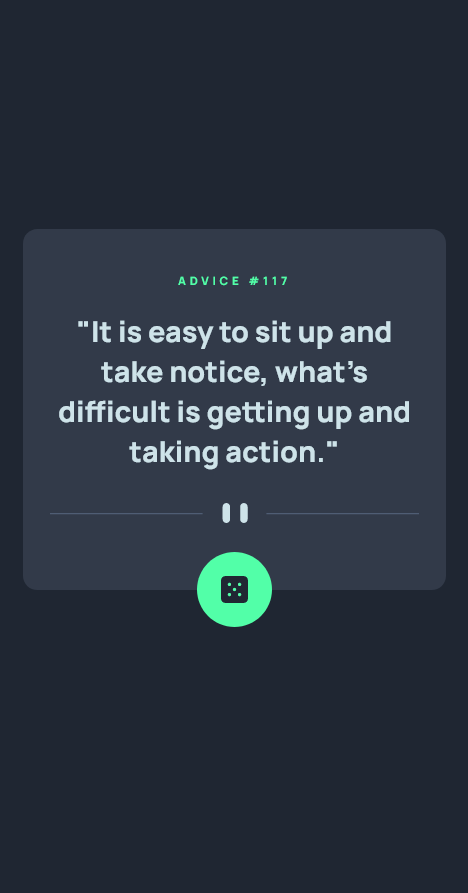

# Frontend Mentor - Advice generator app


## Welcome 👋

This is a solution to the [Advice generator challenge on Frontend Mentor](link). Frontend Mentor challenges help you improve your coding skills by building realistic projects.

## Table of contents 📑

- [Overview](#overview-🌟)
  - [The Challenge](#the-challenge-🧪)
  - [Screenshots](#screenshots-📷)
  - [Links](#links-🔗)
- [My process](#my-process-🏗️)
  - [Built with](#built-with-🛠️)
  - [What I learned](#what-i-learned-🧠)
  - [Continued development](#continued-development-🚀)
  - [Useful resources](#useful-resources-📚)
- [Acknowledgments](#acknowledgments-🙏)
- [Contact](#contact-📧)
- [Author](#author-👤)

## Overview 🌟

### The Challenge 🧪

Users should be able to:

- ✅ View the optimal layout for the app depending on their device's screen size
- ✅ See hover states for all interactive elements on the page
- ✅ Generate a new piece of advice by clicking the dice icon

### Screenshots 📷

_My solution (Desktop):_



_My solution (Mobile)_



### Links 🔗

- Solution repo on github [here]()

## My process 🏗️

### Built with 🛠️

- HTML & CSS
- JavaScript
- Fetch API (Web API)
- Advice Slip API (link [here](https://api.adviceslip.com/))

### What I learned 🧠

So i learned a bit of API best practices, just some stuff about API's in general.
(_This is my first API project actually_)

#### Some simple Fetch API code(which I used in this challenge)

```js
fetch(url)
  .then((response) => response.json())
  .then(doSomething(response));
```

#### Advice Slip API

```js
// fetch api with advice slip url:
fetch("https://api.adviceslip.com/advice")
  .then((response) => {
    return response.json();
  })
  .then((data) => {
    // `data.slip` is an object with `advice` property and `id` property
    const adviceData = data.slip;

    adviceText.textContent = adviceData.advice;
    adviceId.textContent = adviceData.id;
  })
  .catch((error) => {
    console.error(error);
  });
```

### Continued development 🚀

I suppose i could add a loading circle for when a quote is being fetched from the server, but that is not yet decided-

I might or I might not...

### Useful resources 📚

- Big thanks to [this youtube video](https://www.youtube.com/watch?v=2AfzKmgqWUE) - This helped me integrate with the Advice Slip API.

## Acknowledgments 🙏

As I said above, I owe a big thanks to [this youtube video](https://www.youtube.com/watch?v=2AfzKmgqWUE), as it helped with the Advice API usage

## Contact 📧

- Frontend Mentor - [@BeanyTheCoder](https://www.frontendmentor.io/profile/BeanyTheCoder)
- Github - [BeanyTheCoder](https://github.com/BeanyTheCoder)

## Author 👤

My name is Alexander Afoko Jnr. and I am a passionate 13-year-old frontend developer from Ghana.
I hope to build up my portfolio and take my skills to the next level.
